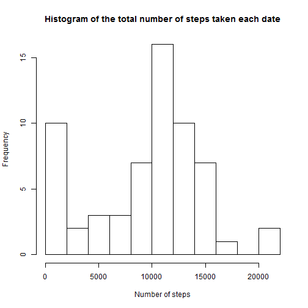
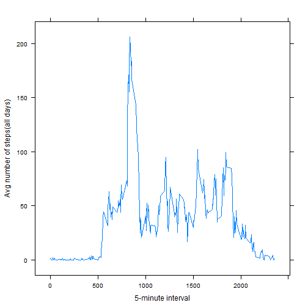
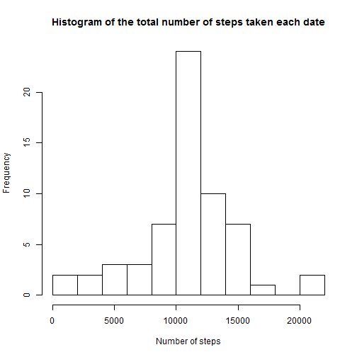
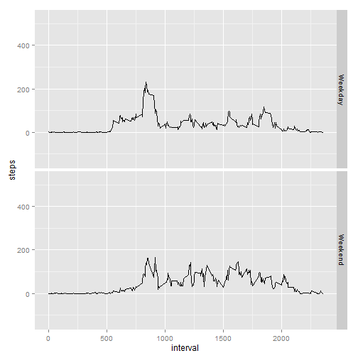

## Loading and Preprocessing the data
The reported data activity (.csv) file data is copied into R for further data analysis. The data has a lot of NA values which are ignored for this part of the analysis. The sum of the number of steps per date is calculated. 


```r
data <- read.csv('C:/Users/Binu/Documents/repdata-data-activity/activity.csv');
data$steps <- as.numeric(data$steps);
data$interval <- as.numeric(data$interval);
```
## What is the mean number of steps taken per day?

#### A histogram of the total number of steps per date is shown below


```r
aggdata <-aggregate(data$steps,list(date = data$date), FUN="sum", na.rm=TRUE);
hist(aggdata$x,breaks = 15,main = "Histogram of the total number of steps taken each date",xlab = 'Number of steps');
```

 

#### Average number of the total number of steps per date.


```r
avgData <-mean(data$steps[!is.na(data$steps)]);
```

```
## [1] 37.3826
```

#### Reporting the median number of the total number of steps per date


```r
medData <-median(data$steps[!is.na(data$steps)])
```


```
## [1] 0
```

## What is the average daily activity pattern?


#### Time series plot of the 5-minute interval (x-axis) and the average number of steps taken, averaged across all days (y-axis)


```r
xyplot(avgDailyPattern$x ~avgDailyPattern$interval,avgDailyPattern,type ="l",xlab = "5-minute interval",ylab = "Avg number of steps(all days)")
```

 

####The 5-minute interval with the maximum number of steps, on average across all the days in the dataset


```r
avgDailyPattern[avgDailyPattern$x==max(avgDailyPattern$x),]
```

```
##     interval        x
## 104      835 206.1698
```

## Imputing missing values

#### The total number of missing values in the dataset

```r
sum(is.na(data$steps))
```

```
## [1] 2304
```

#### The missing step values are imputed using the mean for that 5 minute interval and creating a new dataset using this imputed data


```r
avgIntData <-aggregate(data$steps,by=list(interval = data$interval), FUN=mean,na.rm =TRUE);

# Impute data
imputedData <- data; 
for (i in 1:length(avgIntData$x)) 
 {
  imputedData$steps[is.na(data$steps) & data$interval==avgIntData$interval[i]] <- avgIntData$x[i];
 }
aggImpData <-aggregate(imputedData$steps,list(date = imputedData$date), FUN="sum", na.rm=TRUE);
```

#### The histogram of total number of steps taken per day are recalculated using the imputed data. 


```r
hist(aggImpData$x,breaks = 15,main = "Histogram of the total number of steps taken each date",xlab = 'Number of steps');
```

 


```r
avgImpData <-aggregate(imputedData$steps,list(date = imputedData$date), FUN="mean", na.rm=TRUE);
```


#### 2304 step values were imputed. There is a noticeable increase in the frequency of number of steps between 8000 and 12000

#### Mean number of steps taken per day using the imputed data. 

```r
avgImpData <-mean(imputedData$steps)
```

```
## [1] 37.3826
```

#### Median number of steps taken per day using the imputed data. 


```r
medImpData <-median(imputedData$steps)
```


```
## [1] 0
```

## Are there differences in activity patterns between weekdays and weekends?

#### Creating a new factor variable in the dataset with two levels - "Weekday" and "Weekend" indicating whether a given date is a weekday or weekend day.


```r
day <- weekdays(as.POSIXct(imputedData$date));
day[day=="Sunday"| day=="Saturday"] <- "Weekend";
day[day!="Weekend"] <- "Weekday";

# adding this to the dataset 
imputedData$Day <- day;
#
```

#### Plot containing the 5-minute interval (x-axis) and the average number of steps taken, averaged across all weekday days or weekend days (y-axis)


```r
 library(ggplot2)

 p<- ggplot(imputedData,aes(x =interval,y = steps));

 p + stat_summary(fun.y = mean,fun.ymin = function(x) mean(x) - sd(x), fun.ymax = function(x) mean(x) + sd(x),geom = "line")       +facet_grid(Day~.) 
```

 

